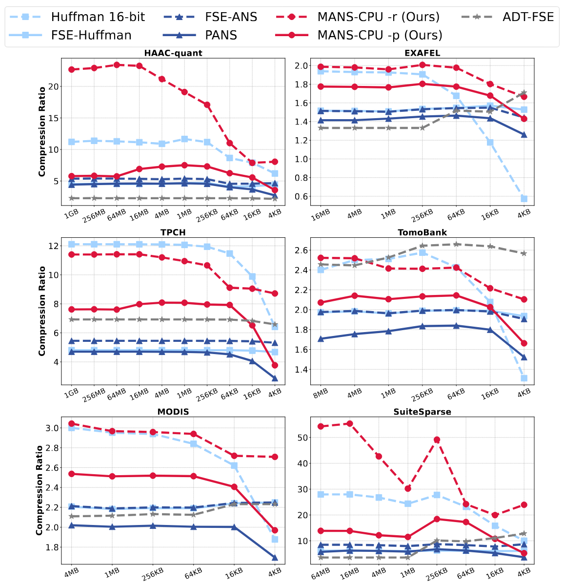
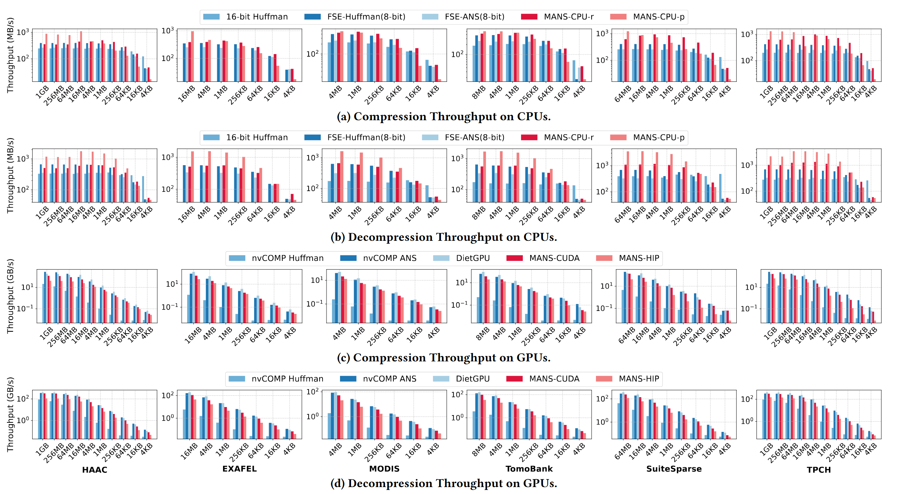

# MANS: Efficient and Portable ANS Encoding for Multi-Byte Integer Data on CPUs and GPUs

[](https://isocpp.org/)
[](LICENSE)


**MANS** is a high-performance compression framework designed to make **Asymmetric Numeral Systems (ANS)** efficient and portable for **multi-byte integer data** across CPUs, NVIDIA GPUs, and AMD GPUs.

At the core of MANS is **ADM (Adaptive Data Mapping)** — a lightweight, distribution-aware transformation that maps 16/32-bit integers into a compact 8-bit domain, significantly improving both compression ratio and throughput while maintaining full numerical fidelity. ⚡

This framework is tailored for high-volume scientific and HPC workloads such as photon science, large-scale simulations, and sensor-array pipelines, where multi-byte integer data is ubiquitous and processed in small slices. 🔬🚀

(C) 2025 by Institute of Computing Technology, Chinese Academy of Sciences.

**Developers**: Wenjing Huang (Lead Developer, Designer of ADM), Jinwu Yang (CPU and GPU Implementations/Optimizations of Parallel ANS Encoders), Shengquan Yin (HIP Version of ANS Encoder)

**Contributors**: Dingwen Tao (Supervisor), Guangming Tan

---

## ✨ Key Features

* **🚀 High-Efficiency Compression**  
  Achieves up to **1.24×** higher compression ratio than standard ANS and **2.37×** higher than 16-bit Huffman.

* **⚡ Cross-Platform High-Performance**  
  Optimized for:
  - NVIDIA GPUs (CUDA)
  - AMD GPUs (HIP/ROCm)
  - Multi-core CPUs with OpenMP + SIMD

* **🧩 Adaptive Data Mapping (ADM)**  
  Converts multi-byte integers into effective 8-bit symbols with **<1% overhead**.

* **🔀 Flexible CPU Modes**  
  - **-p mode**: portable, GPU-consistent ANS implementation  
  - **-r mode**: maximum compression ratio using FSE-ANS

* **📦 Lightweight & Easy Integration**  
  Minimal dependencies, C++17 compatible, and CMake-based build system.

---

## 📈 Compression Ratio Performance

MANS consistently delivers strong compression ratios across real-world scientific datasets:



### **CPU (-r mode)**
- **2.37×** higher compression ratio vs. FSE-ANS  
- **1.32×** higher compression ratio vs. 16-bit Huffman  
- Up to **2.09×** improvement on quantization-based datasets  
- More stable performance on small slices compared to 16-bit Huffman  

### **CPU (-p mode)**
- **1.24×** higher compression ratio than FSE-ANS  
- Slightly lower than -r mode due to parallel ANS design  
- Maintains consistency with GPU behavior

---

## 📊 Throughput Performance

MANS provides strong, consistent performance across diverse platforms:



### **Intel(R) Xeon(R) Gold 5220S**
- **1.92×** faster compression vs. FSE-ANS  
- **2.04×** faster decompression vs. FSE-ANS  

### **NVIDIA A100 GPU**
- **45.14×** faster compression vs. nvCOMP Huffman  
- Up to **288.45×** faster decompression compared to CPU portable mode  

### **AMD MI210 GPU**
- Up to **90.42×** faster compression and **135.86×** faster decompression vs. CPU  
- 0.52× CUDA compression throughput; 0.47× CUDA decompression throughput

---

## ⚙️ Requirements

- **CMake ≥ 3.15**  
- **C++17** compiler  
- **OpenMP** (for CPU parallelization)  
- **CUDA 12.6** (for NVIDIA GPUs)  
- **ROCm** (for AMD GPUs)  
- Git  
- Recommended OS: **Ubuntu 22.04+**

---

## 🔧 Building

### **1️⃣ Clone the Repository**

```shell
git clone https://github.com/ewTomato/MANS.git
```

### **2️⃣ Configure & Build**

```shell
cd MANS; mkdir build; cd build;
cmake -DTARGET_PLATFORM=cpu_nv .. && make (this is for cpu and nvidia platform)
```

<!-- ## Instructions for Use
### For CPU
1. compress

2. decompress -->


```
> Other platform options include:  
> - `cpu` — CPU-only build   
> - `nv` — NVIDIA-only build  
> - `amd` — AMD-only build
> - `cpu_amd` — CPU + AMD build 
> - `all` — NVIDIA + AMD + CPU build  
```
---

## 🚀 Usage

_Comprehensive usage examples are being finalized and will be added soon._  
Below is the general workflow for running MANS once build targets are installed.

### **Basic Command-Line Workflow (Coming Soon)**

**Compression**
On the CPU
```bash
./build/bin/cpu/mappingcpu_uint16 input_file output_file_adm 
./build/bin/cpu/cpuans_compress output_file_adm output_file_mans
```

On the NVIDIA GPU
```bash
./build/bin/nv/nv_mapping_uint16 input_file output_file_adm 
./build/bin/nv/cudaans_compress output_file_adm output_file_mans
```

On the AMD GPU
```bash
./build/bin/amd/amd_mapping_uint16 input_file output_file_adm 
./build/bin/amd/hipans_compress output_file_adm output_file_mans
```

<!-- **Decompression**
On the CPU
```bash

./build/bin/cpu/cpuans_decompress output_file_mans output_file_adm
```

On the NVIDIA GPU
```bash

./build/bin/nv/cudaans_decompress output_file_mans output_file_adm
```

On the AMD GPU
```bash
./build/bin/amd/hipans_decompress output_file_mans output_file_adm
``` -->

---

## 📁 Project Structure

```
MANS/
 ├── amd/              # ADM, ANS, GPU kernels(AMD version)
 ├── build/            # CMake build directory (generated by user)
 ├── cpu/              # ADM, PANS(CPU version)
 ├── nv/               # ADM, ANS, GPU kernels(NVIDIA version)
 ├── testdata/ 
 ├── tools/            # test scripts
 └── README.md
 ...
```
---

## 📜 License

MANS is released under the **MIT License**.  
Please see the `LICENSE` file for full details.

---

## 📚 Citation

If you use **MANS** in your research or software, please cite our work:

```
@inproceedings{huang2025mans,
  title={MANS: Efficient and Portable ANS Encoding for Multi-Byte Integer Data on CPUs and GPUs},
  author={Huang, Wenjing and Yang, Jinwu and Yin, Shengquan and Li, Haoxu and Gu, Yida and Liu, Zedong and Jing, Xing and Wei, Zheng and Fu, Shiyuan and Hu, Hao and others},
  booktitle={Proceedings of the International Conference for High Performance Computing, Networking, Storage and Analysis},
  pages={1299--1314},
  year={2025},
  DOI={10.1145/3712285.3759825}
}
```

More details and related materials will coming soon.
